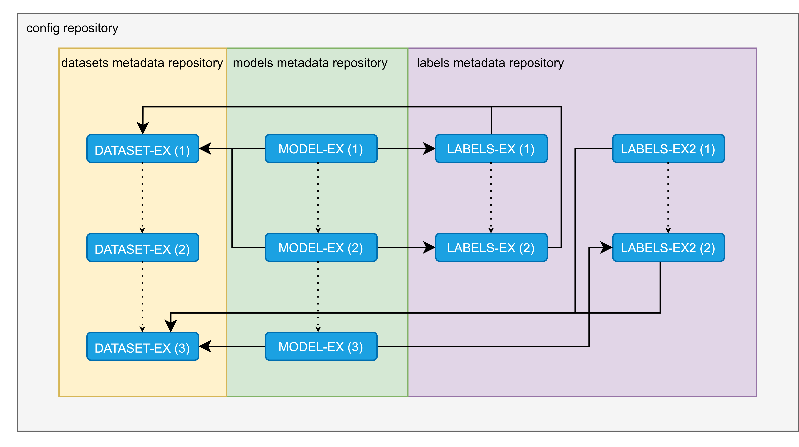

# Relationships API methods

This notebook describes a basic flow in the context of relationships between entities with the API provided by ML-Git.

In it, we'll show you how to use the set of commands provided. You can check the documentation for more information: [API documentation](https://github.com/HPInc/ml-git/blob/main/docs/api/README.md)

### Notebook prerequisites

This notebook uses the GitHub API to access a reset and does Ml-Git operations on its contents, so before running this notebook, take the following steps:

- Have a GitHub [SHH access key](https://docs.github.com/en/authentication/connecting-to-github-with-ssh/adding-a-new-ssh-key-to-your-github-account) so that you can use the repository information retrieval API.

- Have a GitHub repository that the SHH key has access to.

### 1 - Context

In this notebook we consider a scenario of an ML-Git project with the following settings:

- A versioned config file in GitHub. Pointing to the entities' metadata repositories.

- Each entity type having its metadata repository.

- One mode entity (model-ex), two labels entities (labels-ex and labels-ex2) and one dataset entity (dataset-ex)

- Entities have relationships defined at versioning time.

This settings mentioned above can be better visualized in the diagram below:



### 2 - Configuring

To use the methods, you will need to import the API and define some constants related to the user's credential:

Below are the constants described in the pre-requirements section, where:['removed'] should be replaced by the SHH access key and api_url can be modified if necessary as reported in the GitHub API documentation.


```python
from ml_git.api import MLGitAPI
from ml_git import api

github_token = ['removed']
api_url = 'https://api.github.com'
```

    

After defining the variables to configure, it will be possible to start a manager that will be responsible for operating on the github API.


```python
api = MLGitAPI()
manager = api.init_entity_manager(github_token, api_url)
```

    

We will use the manager to execute the commands in the next steps.

### 3 - Methods

#### 3.1 - Get Entities

The *get_entities* method allows the user to get a list of entities being versioned in a project. For this, the user must inform the path to the configuration file, whether this path is a local directory or the name of a git repository. The path can be modified using the config_repository_name field, in our example case the configuration file is in 'user/mlgit-config-repository.


```python
config_repository_name='user/mlgit-config-repository'

project_entities = manager.get_entities(config_repo_name=config_repository_name)

print("Entities found: {}".format(len(project_entities)))
print("Example of output object:\n{}".format(project_entities[3]))
```

    Entities found: 4
    Example of output object:
    {
      "name": "model-ex",
      "entity_type": "model",
      "metadata": {
        "full_name": "user/mlgit-models",
        "git_url": "git@github.com:user/mlgit-models.git",
        "html_url": "https://github.com/user/mlgit-models",
        "owner_email": "user@gmail.com",
        "owner_name": "User Name"
      },
      "last_spec_version": {
        "version": 3,
        "tag": "test__model-ex__3",
        "mutability": "flexible",
        "categories": [
          "test"
        ],
        "amount": 3,
        "size": "27 Bytes",
        "storage": {
          "type": "s3h",
          "bucket": "mlgit-bucket"
        }
      }
    }
    

As expected the API found 4 entities in the repository (dataset-ex, model-ex, labels-ex, labels-ex2).

#### 3.2 - Get Entity Versions

The *get_entity_version* method allows the user to get a list of spec versions found for an especific entity.


```python
selected_entity = project_entities[3]

entity_versions = manager.get_entity_versions(selected_entity.name, selected_entity.metadata.full_name)
print("Versions found: {}".format(len(entity_versions)))
print("Example of output object:\n{}".format(entity_versions[len(entity_versions)-1]))
```

    Versions found: 3
    Example of output object:
    {
      "version": 1,
      "tag": "test__model-ex__1",
      "mutability": "flexible",
      "categories": [
        "test"
      ],
      "amount": 1,
      "size": "9 Bytes",
      "storage": {
        "type": "s3h",
        "bucket": "mlgit-bucket"
      }
    }
    

As expected the API found 3 versions for the model-ex entity.

#### 3.3 - Get Linked Entities

The *get_linked_entities* method allows the user to get a list of linked entities found for an entity in a specific version.


```python
entity_version = 1
linked_entities_in_version = manager.get_linked_entities(selected_entity.name, entity_version, selected_entity.metadata.full_name)
print("Output: \n{}".format(linked_entities_in_version))
```

    Output: 
    [{
      "tag": "test__dataset-ex__1",
      "name": "dataset-ex",
      "version": "1",
      "entity_type": "dataset"
    }, {
      "tag": "test__labels-ex__1",
      "name": "labels-ex",
      "version": "1",
      "entity_type": "labels"
    }]
    

If we go back to the diagram, we can see that as shown in the output, version 1 of the model-ex entity is related to dataset-ex in version 1 and labels-ex in version 1.

#### 3.4 - Get Entity Relationships

The *get_linked_entities* method allows the user to get the list of all relationships that the specific entity has. For this it goes through all versions of the entity and checks the relationships that have been established.


```python
entity_relationships = manager.get_entity_relationships(selected_entity.name, selected_entity.metadata.full_name)

count_relationships = 0
for version in entity_relationships[selected_entity.name]:
    count_relationships += len(version.relationships)
    
print("Relationships found: {}".format(count_relationships))
print("Example of output object:\n{}".format(entity_relationships[selected_entity.name][0]))
```

    Relationships found: 6
    Example of output object:
    {
      "version": 3,
      "tag": "test__model-ex__3",
      "relationships": [
        {
          "tag": "test__dataset-ex__3",
          "name": "dataset-ex",
          "version": "3",
          "entity_type": "dataset"
        },
        {
          "tag": "test__labels-ex2__2",
          "name": "labels-ex2",
          "version": "2",
          "entity_type": "labels"
        }
      ]
    }
    

In addition, this command allows the user to define the output format, which can be json (as in the previous example) or CSV. If he wants, he can also define the export_path to export the data to a file.

An example of how to use the generated csv can be seen below:


```python
import pandas as pd

entity_relationships_csv = manager.get_entity_relationships(selected_entity.name, selected_entity.metadata.full_name, export_type='csv')

df = pd.read_csv(entity_relationships_csv)
df
```


<div>
<style scoped>
    .dataframe tbody tr th:only-of-type {
        vertical-align: middle;
    }

    .dataframe tbody tr th {
        vertical-align: top;
    }

    .dataframe thead th {
        text-align: right;
    }
</style>
<table border="1" class="dataframe">
  <thead>
    <tr style="text-align: right;">
      <th></th>
      <th>from_tag</th>
      <th>from_name</th>
      <th>from_version</th>
      <th>from_type</th>
      <th>to_tag</th>
      <th>to_name</th>
      <th>to_version</th>
      <th>to_type</th>
    </tr>
  </thead>
  <tbody>
    <tr>
      <th>0</th>
      <td>test__model-ex__3</td>
      <td>model-ex</td>
      <td>3</td>
      <td>model</td>
      <td>test__dataset-ex__3</td>
      <td>dataset-ex</td>
      <td>3</td>
      <td>dataset</td>
    </tr>
    <tr>
      <th>1</th>
      <td>test__model-ex__3</td>
      <td>model-ex</td>
      <td>3</td>
      <td>model</td>
      <td>test__labels-ex2__2</td>
      <td>labels-ex2</td>
      <td>2</td>
      <td>labels</td>
    </tr>
    <tr>
      <th>2</th>
      <td>test__model-ex__2</td>
      <td>model-ex</td>
      <td>2</td>
      <td>model</td>
      <td>test__dataset-ex__1</td>
      <td>dataset-ex</td>
      <td>1</td>
      <td>dataset</td>
    </tr>
    <tr>
      <th>3</th>
      <td>test__model-ex__2</td>
      <td>model-ex</td>
      <td>2</td>
      <td>model</td>
      <td>test__labels-ex__2</td>
      <td>labels-ex</td>
      <td>2</td>
      <td>labels</td>
    </tr>
    <tr>
      <th>4</th>
      <td>test__model-ex__1</td>
      <td>model-ex</td>
      <td>1</td>
      <td>model</td>
      <td>test__dataset-ex__1</td>
      <td>dataset-ex</td>
      <td>1</td>
      <td>dataset</td>
    </tr>
    <tr>
      <th>5</th>
      <td>test__model-ex__1</td>
      <td>model-ex</td>
      <td>1</td>
      <td>model</td>
      <td>test__labels-ex__1</td>
      <td>labels-ex</td>
      <td>1</td>
      <td>labels</td>
    </tr>
  </tbody>
</table>
</div>


    

#### 3.5 - Get Project Entities Relationships

Like the previous command, the *get_project_entities_relationships* command aims to present the entity relationships, but with this single command the user can capture the relationships of all entities that are in the project.

In our case we have 4 versioned entities, so the command will check the relationships of these 4 entities.


```python
project_entities_relationships = manager.get_project_entities_relationships(config_repository_name)

count_relationships = 0
for entity in project_entities_relationships:
    for version in project_entities_relationships[entity]:
        count_relationships += len(version.relationships)
    
print("Relationships found: {}".format(count_relationships))
print("Example of output object:\n{}".format(project_entities_relationships[entity][0]))
```

    Relationships found: 10
    Example of output object:
    {
      "version": 3,
      "tag": "test__model-ex__3",
      "relationships": [
        {
          "tag": "test__dataset-ex__3",
          "name": "dataset-ex",
          "version": "3",
          "entity_type": "dataset"
        },
        {
          "tag": "test__labels-ex2__2",
          "name": "labels-ex2",
          "version": "2",
          "entity_type": "labels"
        }
      ]
    }
    

Like the previous one, it is possible to export the result in csv.


```python
project_entities_relationships_csv = manager.get_project_entities_relationships(config_repository_name, export_type='csv')
df = pd.read_csv(project_entities_relationships_csv)
df
```


<div>
<style scoped>
    .dataframe tbody tr th:only-of-type {
        vertical-align: middle;
    }

    .dataframe tbody tr th {
        vertical-align: top;
    }

    .dataframe thead th {
        text-align: right;
    }
</style>
<table border="1" class="dataframe">
  <thead>
    <tr style="text-align: right;">
      <th></th>
      <th>from_tag</th>
      <th>from_name</th>
      <th>from_version</th>
      <th>from_type</th>
      <th>to_tag</th>
      <th>to_name</th>
      <th>to_version</th>
      <th>to_type</th>
    </tr>
  </thead>
  <tbody>
    <tr>
      <th>0</th>
      <td>test__labels-ex2__2</td>
      <td>labels-ex2</td>
      <td>2</td>
      <td>labels</td>
      <td>test__dataset-ex__3</td>
      <td>dataset-ex</td>
      <td>3</td>
      <td>dataset</td>
    </tr>
    <tr>
      <th>1</th>
      <td>test__labels-ex2__1</td>
      <td>labels-ex2</td>
      <td>1</td>
      <td>labels</td>
      <td>test__dataset-ex__3</td>
      <td>dataset-ex</td>
      <td>3</td>
      <td>dataset</td>
    </tr>
    <tr>
      <th>2</th>
      <td>test__labels-ex__2</td>
      <td>labels-ex</td>
      <td>2</td>
      <td>labels</td>
      <td>test__dataset-ex__1</td>
      <td>dataset-ex</td>
      <td>1</td>
      <td>dataset</td>
    </tr>
    <tr>
      <th>3</th>
      <td>test__labels-ex__1</td>
      <td>labels-ex</td>
      <td>1</td>
      <td>labels</td>
      <td>test__dataset-ex__1</td>
      <td>dataset-ex</td>
      <td>1</td>
      <td>dataset</td>
    </tr>
    <tr>
      <th>4</th>
      <td>test__model-ex__3</td>
      <td>model-ex</td>
      <td>3</td>
      <td>model</td>
      <td>test__dataset-ex__3</td>
      <td>dataset-ex</td>
      <td>3</td>
      <td>dataset</td>
    </tr>
    <tr>
      <th>5</th>
      <td>test__model-ex__3</td>
      <td>model-ex</td>
      <td>3</td>
      <td>model</td>
      <td>test__labels-ex2__2</td>
      <td>labels-ex2</td>
      <td>2</td>
      <td>labels</td>
    </tr>
    <tr>
      <th>6</th>
      <td>test__model-ex__2</td>
      <td>model-ex</td>
      <td>2</td>
      <td>model</td>
      <td>test__dataset-ex__1</td>
      <td>dataset-ex</td>
      <td>1</td>
      <td>dataset</td>
    </tr>
    <tr>
      <th>7</th>
      <td>test__model-ex__2</td>
      <td>model-ex</td>
      <td>2</td>
      <td>model</td>
      <td>test__labels-ex__2</td>
      <td>labels-ex</td>
      <td>2</td>
      <td>labels</td>
    </tr>
    <tr>
      <th>8</th>
      <td>test__model-ex__1</td>
      <td>model-ex</td>
      <td>1</td>
      <td>model</td>
      <td>test__dataset-ex__1</td>
      <td>dataset-ex</td>
      <td>1</td>
      <td>dataset</td>
    </tr>
    <tr>
      <th>9</th>
      <td>test__model-ex__1</td>
      <td>model-ex</td>
      <td>1</td>
      <td>model</td>
      <td>test__labels-ex__1</td>
      <td>labels-ex</td>
      <td>1</td>
      <td>labels</td>
    </tr>
  </tbody>
</table>
</div>


    

As expected, all the relationships that were highlighted in the diagram were captured by the API.
